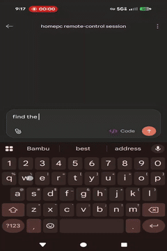

# ghosthost

**A one-line command that turns any local file into a temporary, tokenized URL — so the coding agent on your desktop can hand your phone a clickable link to the thing it just made.**

You're driving Claude on your home box through a `remote-control` Claude session from your phone or work PC. It just rendered a video, generated a plot, finished a model, or dumped an ML output to disk. The result is sitting on a drive you can't see from here.

```text
you: let me see it
claude: ghosthost share ./renders/out.mp4
        url:        http://homepc.tail-4a9c2e.ts.net:8750/t/8f2b1c04e7a6/out.mp4
        id:         8f2b1c04e7a6
        expires_at: 2026-04-20T14:32:08Z
```

You tap the link on your phone. The video plays in the browser. Twenty-four hours later it stops working.

<p align="center">
  
  <br>
  <sub>Full-quality mp4: <a href="docs/demo-phone.mp4">docs/demo-phone.mp4</a></sub>
</p>

That's the whole product. A single Go binary with a CLI in front of a background HTTP daemon. Shares carry 128-bit tokens, auto-expire, and the daemon binds to your Tailscale interface by default so the URLs only exist on your tailnet. Ships with a Claude skill (`skills/ghosthost/SKILL.md`) so the agent reaches for `ghosthost share` on its own when you ask to see a file.

Status: v0.1-ish. Windows and Linux run the full test suite on every CI push (including the end-to-end smoke test); macOS cross-compiles cleanly but isn't currently exercised in CI.

## What it serves

- **Video** — `.mp4`, `.webm`, `.mov`, `.mkv`, `.avi`, `.m4v`, `.ogv`, `.mpg`/`.mpeg`, `.ts`. Wrapped in an HTML `<video>` player, muted autoplay (so browsers honor it).
- **Audio** — `.mp3`, `.wav`, `.flac`, `.m4a`, `.aac`, `.ogg`/`.oga`, `.opus`. Wrapped in an HTML `<audio>` player, autoplay, not muted.
- **Images** — `.png`, `.jpg`/`.jpeg`, `.gif`, `.webp`, `.avif`, `.svg`, `.bmp`, `.ico`. Rendered inline by the browser.
- **Documents and text** — `.pdf`, `.txt`, `.log`, `.md`, `.json`, `.csv`, `.yaml`/`.yml`, `.html`/`.htm`, `.xml`. Served inline; the browser decides how to display.
- **Anything else** — served as a normal download.

Append `?dl=1` to any URL to force `Content-Disposition: attachment` and skip the inline player/viewer.

## Common use cases

- A coding LLM just generated a video, plot, PNG, or scraped a page, and you want to eyeball the result without shuffling files.
- A long ML job on your GPU box produced a Stable Diffusion output, training-loss plot, generated audio clip, or checkpoint sample.
- A browser-automation or scraping agent dropped screenshots, PDFs, or CSVs on disk.
- You're on your phone, the file is on your desktop, and scp / a throwaway web server / a Dropbox round-trip is overkill.

## Claude Code setup

Copy `skills/ghosthost/SKILL.md` into the Claude skills directory and restart Claude:

```bash
# macOS/Linux
mkdir -p ~/.claude/skills/ghosthost
cp skills/ghosthost/SKILL.md ~/.claude/skills/ghosthost/SKILL.md
```

```text
# Windows
%USERPROFILE%\.claude\skills\ghosthost\SKILL.md
```

Once installed, Claude will invoke `ghosthost share` on its own when you ask it to show or host a local artifact. See [CLAUDE.md](CLAUDE.md) for the full end-to-end setup and smoke-test checklist.

## Install

```bash
go install github.com/godspede/ghosthost/cmd/ghosthost@latest
```

Requires Go 1.25+ (per `go.mod`). Prebuilt binaries for Windows, Linux, and macOS will ship through goreleaser — see the Releases page.

## Configuration

First invocation writes a template config and exits with a friendly error. Default paths:

- Windows: `%APPDATA%\ghosthost\config.toml`
- Linux/macOS: `~/.config/ghosthost/config.toml`

Override with `--config <path>` on any command.

```toml
host          = "homepc.tail-4a9c2e.ts.net"
bind          = "tailscale"   # or an explicit IP, or "0.0.0.0"
port          = 8750
admin_port    = 8751
data_dir      = "C:\\Users\\you\\AppData\\Local\\ghosthost"
default_ttl   = "24h"
idle_shutdown = "30m"
```

On first run, `ghosthost` shells out to `tailscale status --json` and pre-fills `host` with your MagicDNS name when available. `bind = "tailscale"` fails fast at daemon start with a clear error if the `tailscale` CLI is missing or not logged in. `bind = "0.0.0.0"` exposes the server on every interface the host joins — the daemon logs a loud warning when that's set.

### HTTPS (optional)

Plain HTTP is fine on a trusted tailnet. For HTTPS, point `tls_cert` and `tls_key` at PEM files:

```toml
tls_cert = "/path/to/cert.pem"
tls_key  = "/path/to/key.pem"
```

If both are set, the public server uses TLS and `ghosthost share` returns `https://` URLs. Set only one and the daemon refuses to start.

For Tailscale users, `tailscale cert <your-magicdns-name>` produces a browser-trusted cert/key pair via Tailscale's Let's Encrypt integration. Point the two config keys at those files and you're done. Rotating the cert is just rewriting the files — the daemon reloads them on restart because `http.Server.ServeTLS` re-reads the paths each time it starts.

The admin API on `127.0.0.1` stays plain HTTP regardless; TLS adds nothing on a loopback socket.

## Commands

| Command | What it does |
|---|---|
| `ghosthost share <path> [--ttl 24h] [--as name]` | Create a share, print the URL. |
| `ghosthost list` | Active shares. |
| `ghosthost history [--limit N]` | All historical share events. |
| `ghosthost reshare <id>` | Issue a fresh URL for a prior share. |
| `ghosthost revoke <id>` | Stop serving immediately. |
| `ghosthost status` | Daemon liveness. |
| `ghosthost stop` | Shut the daemon down (it will auto-spawn again on next use). |

Add `--json` to any command for machine-readable output. The daemon auto-spawns on first use and self-exits after `idle_shutdown` (30 min default) with no active shares.

## Transport options

Tailscale is what `ghosthost` is designed around, but the URL the daemon prints is just `https://<host>:<port>/s/<token>/<name>` — nothing about the binary is hard-wired to Tailscale. Any transport that lands a reachable `host` at the daemon's listening interface works: your LAN IP, another VPN (WireGuard, Nebula, ZeroTier), or a public reverse proxy / tunnel terminating TLS in front of the daemon. Set `host` and `bind` accordingly. See [CLAUDE.md](CLAUDE.md#alternative-transports) for concrete recipes.

## Security

- Tokens are 128 bits from `crypto/rand`, compared in constant time. Only their SHA-256 digests are written to disk (`history.jsonl`).
- The admin API is bound to `127.0.0.1` only and authenticated by a per-daemon bearer secret stored in an ACL-restricted lockfile.
- Shares expire after `default_ttl` (24h default); revocation is immediate.
- Tokens in the URL are the only authentication on the data-plane. Public exposure is at your own risk.

See [SECURITY.md](SECURITY.md) for the full threat model.

## Platform support

Windows is the primary target. All the Windows-specific hardening lives in-tree: `LockFileEx` on the daemon lockfile, reparse-point rejection when resolving share paths, detached-process flags on daemon spawn. Linux and macOS binaries build cleanly and the core flows work; cross-platform parity is still shaking out for v0.1.

## JSON output stability

Every JSON response from the CLI and admin API includes a `"schema_version"` field. Within a major version, schemas are append-only. Breaking changes require a major version bump.

## Exit codes

| Code | Meaning                          |
|-----:|----------------------------------|
|    0 | success                          |
|    1 | generic error                    |
|    2 | usage error                      |
|    3 | config missing or invalid        |
|    4 | daemon unreachable after spawn   |
|    5 | id not found                     |
|    6 | source path invalid or missing   |

## License

MIT.
